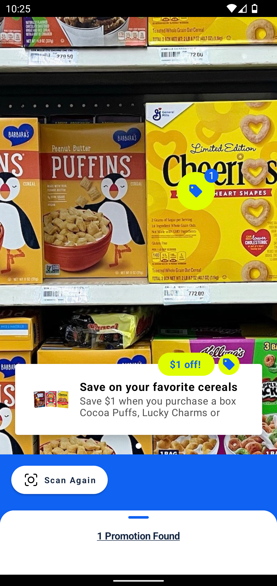
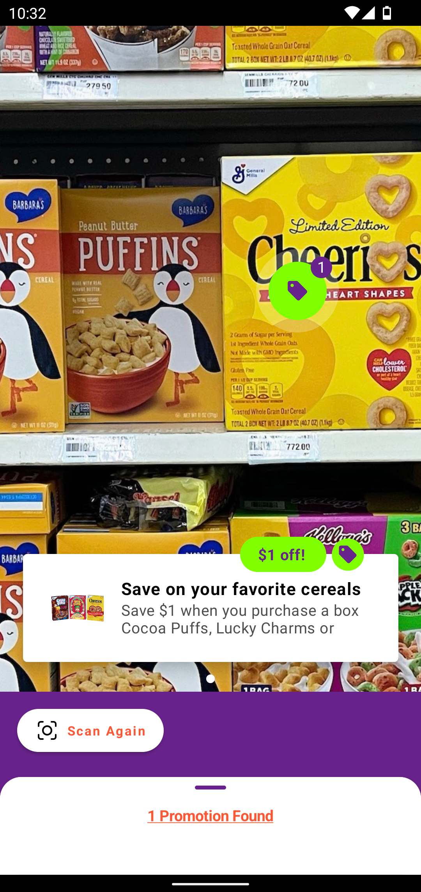
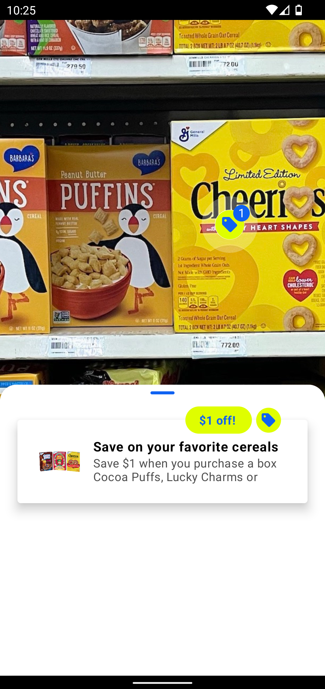
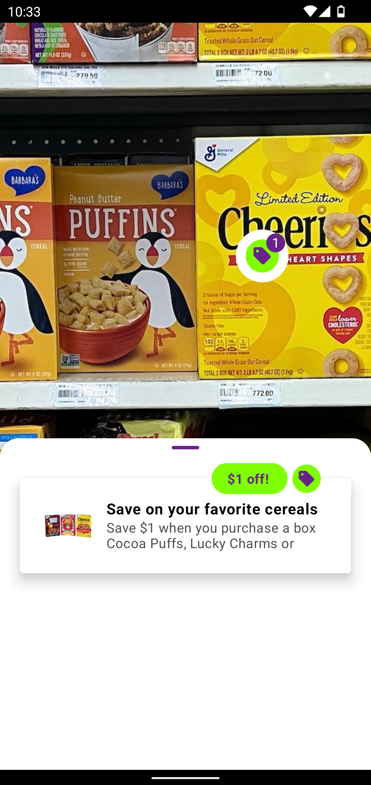
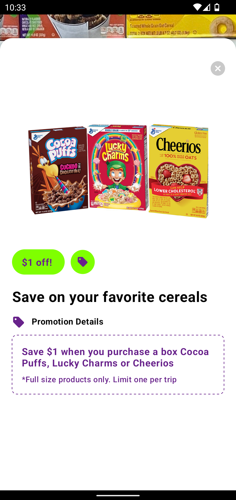
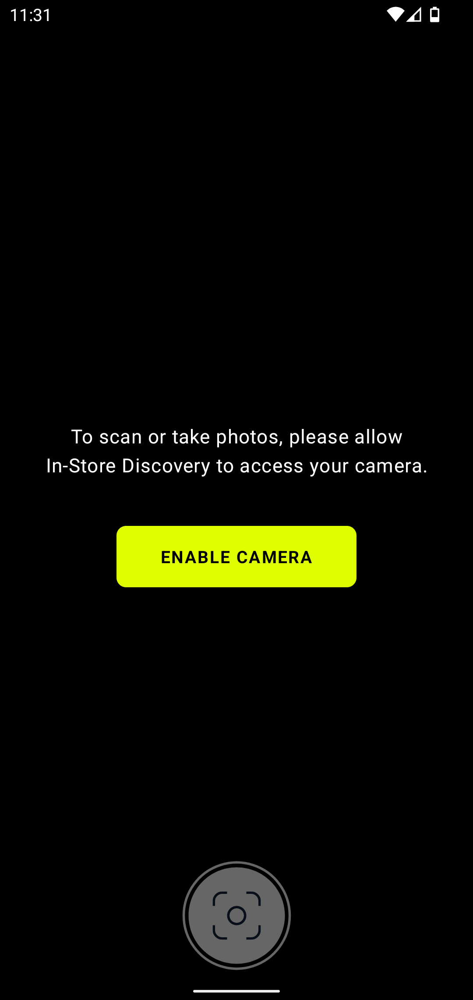
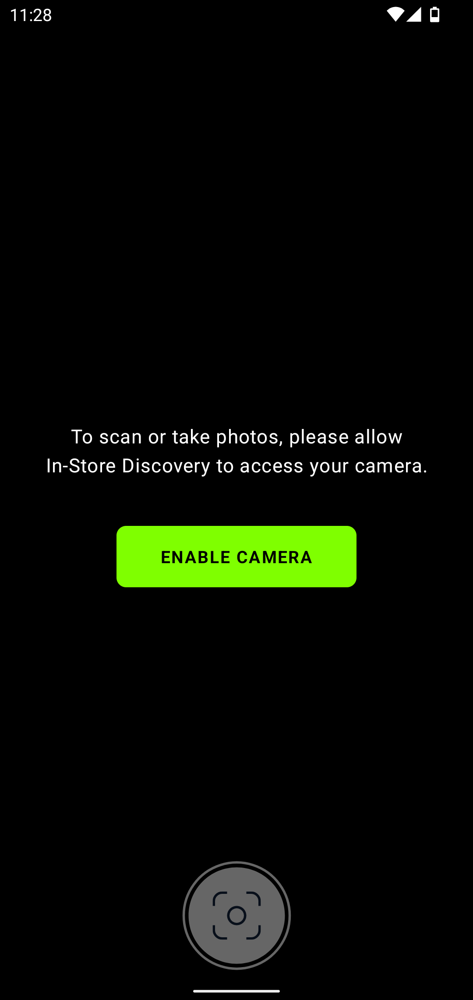

# Custom UX 

Customization can be achieved by passing the `Theme` object to the `CameraSettings` which is used when instantiating fragments as described on the Getting Started [page](getting_started.md#usage).

An example of customization is shown in the code sample below.


```kotlin
val options = CameraSettings {
    theme(
        Theme(
            ThemeColors {
                primaryColor(0xFF_682_28B)      // purple  
                secondaryColor(0xFF_7FF_F00)    // green
                textColor(0xFF_FF5_733)         // orange
            }
        )
    )
}
```

The following sections contain screenshots of how customization from above affects different parts of the UI. 


## Scanning image banner
| Default     | Custom |
| ----------- | ----------- |
|   |  |

## Results screen
| Default     | Custom |
| ----------- | ----------- |
|   |  |

## Bottom sheet with a list of the promotion results
| Default     | Custom |
| ----------- | ----------- |
|   |  |

## Bottom sheet with promotion's details
| Default     | Custom |
| ----------- | ----------- |
|   |  |

## No promotions banner
| Default     | Custom |
| ----------- | ----------- |
|   |  |

## Permission screen
| Default     | Custom |
| ----------- | ----------- |
|   |  |

  