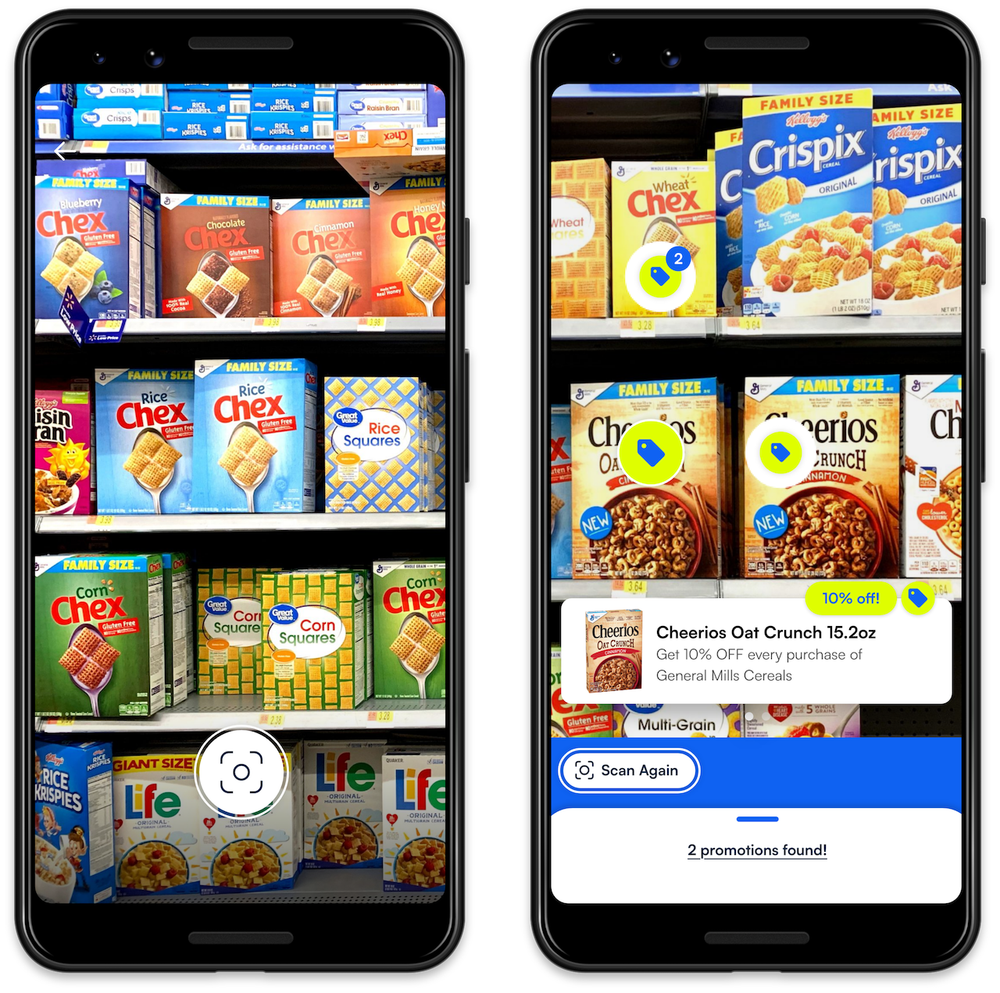

# BlinkShelf

The BlinkShelf SDK lets you build a fantastic in-store experience in your Android app. Effortlessly scan the products in the grocery store and get all the needed data about them!

    

Interested to learn more? Check the official Microblink [page](https://microblink.com/commerce/product-recognition/){target=_blank} for more info.

## Requirements

- AndroidX
- Min SDK 21+
- Compile SDK: 33+
- Java 8+