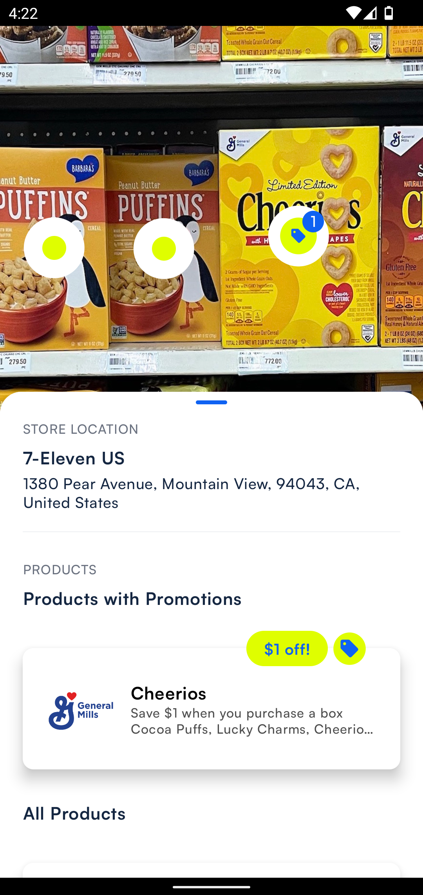

# Store detection

Store detection allows retrieving info about the store where the user is currently located. 

Data about the detected store contain:

- store's name
- store's address, including street name, city, state, zip code, and country
- etc.

Here is an example of the detected store data in the out-of-the-box experience:

| Detected store shown in the bottom right corner            | Detected store details                                         |
|------------------------------------------------------------|----------------------------------------------------------------|
|  |  |


## Enabling store detection

To have the best store detection results, location is required. It is recommended to add the dependency on Google's [`FusedLocationProviderClient`](https://developers.google.com/android/reference/com/google/android/gms/location/FusedLocationProviderClient), as shown below

```groovy
dependencies {
    implementation("com.google.android.gms:play-services-location:<lib_version>")
    implementation("org.jetbrains.kotlinx:kotlinx-coroutines-play-services:<lib_version>")
}
```

More details on adding dependencies can be found in the [Getting Started](getting_started.md#project-integration-and-initialization).

Adding the dependency will allow retrieval of enriched results data and provide the best user experience when the location is turned on.

After the dependencies are added, make sure to enable store detection in the `RecognitionSettings` as explained [here](sdk_options.md#products-options).


