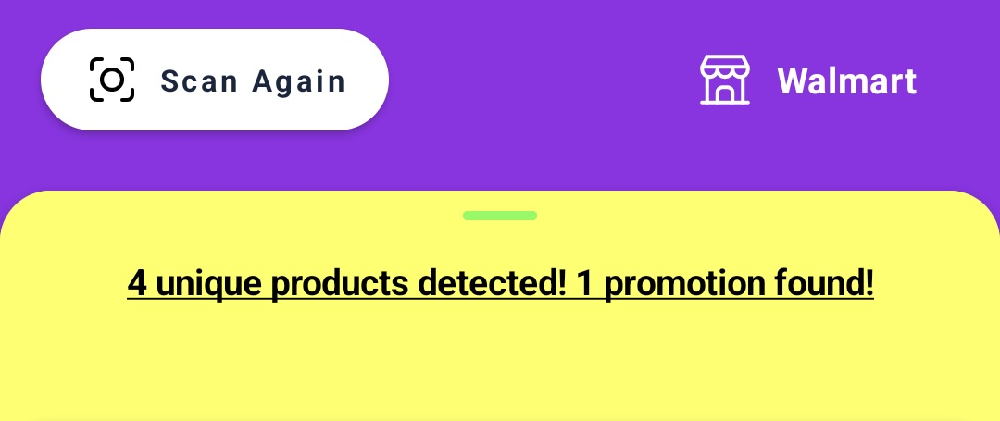

# Theming 

Theming can be achieved by passing the [`Theme`](https://microblink.github.io/blinkshelf-android/javadocs/camera-ui/recognition-camera-ui/com.microblink.recognition.camera.ui/-theme/index.html) object to the [`RecognitionSettings`](https://microblink.github.io/blinkshelf-android/javadocs/camera-ui/recognition-camera-ui/com.microblink.recognition.camera.ui/-recognition-settings/index.html), which is used when instantiating fragments as described on the Getting Started [page](getting_started.md#usage).
`Theme` class provides different customization options, like defining app colors and styles of different UI components.

An example of theming is shown in the code sample below.

```kotlin
val settings = RecognitionSettings {
    theme(
        Theme {
            themeColors(
                ThemeColors.Builder()
                .primaryColor(Color.resourceColor(context, R.color.purple))
                .secondaryColor(Color.hexColor(0xFF_7FF_F00))
                .textColor(Color.composeColor(ComposeColor.Yellow))
                .build()
            )
            statusBannerStyle(
                StatusBannerStyle.Builder()
                .noPromotionText(Text.stringRes(R.string.text))
                .build()
            )
            resultDetailsStyle(ResultDetailsStyle.Builder()
                .detailsIcon(Icon.drawableRes(R.drawable.ic_tag))
                .detailsIconTintColor(Color.hexColor(0xFF_000_000))
                .build()
            )
            permissionOverlayStyle(
                PermissionOverlayStyle.Builder()
                .backgroundColor(Color.composeColor(ComposeColor.LightGray))
                .buttonBackgroundColor(Color.hexColor(0xFF_000_000))
                .buttonText(Text.stringRes(R.string.button))
                .buttonTextColor(Color.hexColor(0xFF_FFF_FFF))
                .build()
            )
        }
    )
}
```

When specifying any color, make sure to use SDK's [`Color`](https://microblink.github.io/blinkshelf-android/javadocs/camera-ui/recognition-camera-ui/com.microblink.recognition.camera.ui/-color/index.html) class.
The class contains helper methods that can create a `Color` object from resource color, hex value, or Compose Color.

The following sections contain a detailed description of how `Theme` can be used to customize the experience.

## Colors
It is possible to define the following colors as part of the [`ThemeColors`](https://microblink.github.io/blinkshelf-android/javadocs/camera-ui/recognition-camera-ui/com.microblink.recognition.camera.ui/-theme-colors/index.html) object:

- the primary color, the default value is `#0F62F2`
- the secondary color, the default value is `#DFFE00`
- the text color, the default value is `#142641`

```kotlin
ThemeColors.Builder()
    .primaryColor(Color.resourceColor(context, R.color.purple))
    .secondaryColor(Color.hexColor(0xFF_7FF_F00))
    .textColor(Color.composeColor(ComposeColor.Yellow))
    .build()
```

Note that defining some of the styles below can override the colors mentioned in this section.


## Boundary Style

If a [region of interest](sdk_options.md#region-of-interest) is defined, boundaries will be applied to the scanning frame.

```kotlin
BoundaryStyle.Builder()
    .color(Color.composeColor(ComposeColor.Red))
    .build()
```

| Default Boundary                                               | Custom Boundary                                              |
|----------------------------------------------------------------|--------------------------------------------------------------|
|  |  |


## Status Banner Style

Style used to define the look and feel of the status banner that appears for certain errors, like "no results found".

```kotlin
StatusBannerStyle.Builder()
    .textColor(Color.hexColor(0xFF_FFF_FFF))
    .backgroundColor(Color.hexColor(0xFF_000_000))
    .noPromotionText(Text.stringRes(R.string.text))
    .build()
```

| Default Status Banner                                                    | Custom Status Banner                                                   |
|--------------------------------------------------------------------------|------------------------------------------------------------------------|
|  |  |


## Promotion Banner Style

Style used to define the look and feel of the promotion banner shown on top of the results.

```kotlin
PromotionBannerStyle.Builder()
    .textColor(Color.composeColor(ComposeColor.Yellow))
    .backgroundColor(Color.composeColor(ComposeColor.Red))
    .build()
```

| Default Promotion Banner                                                                          | Custom Promotion Banner                                                                         |
|---------------------------------------------------------------------------------------------------|-------------------------------------------------------------------------------------------------|
|    |    |
|  |  |


## Promotion Tag Style

Style used to define the look of the indicator similar to the banner, containing an icon, shown on top of the results.

```kotlin
PromotionTagStyle.Builder()
    .icon(Icon.drawableRes(R.drawable.ic_tag))
    .tintColor(Color.composeColor(ComposeColor.Yellow))
    .backgroundColor(Color.composeColor(ComposeColor.Red))
    .build()
```

| Default Promotion Tag                                                                    | Custom Promotion Tag                                                                   |
|------------------------------------------------------------------------------------------|----------------------------------------------------------------------------------------|
|    |    |
|  |  |


## Close Button Style

Style used to define the camera's close button appearance.

```kotlin
CloseButtonStyle.Builder()
    .icon(Icon.drawableRes(R.drawable.ic_close))
    .tintColor(Color.composeColor(ComposeColor.Magenta))
    .build()
```

| Default Close Button                                                   | Custom Close Button                                                  |
|------------------------------------------------------------------------|----------------------------------------------------------------------|
|  |  |


## Camera Button Style

Style used to define the camera button appearance.

```kotlin
CameraButtonStyle.Builder()
    .icon(Icon.drawableRes(R.drawable.ic_camera))
    .tintColor(Color.composeColor(ComposeColor.Cyan))
    .build()
```

| Default Camera Button                                                    | Custom Camera Button                                                   |
|--------------------------------------------------------------------------|------------------------------------------------------------------------|
|  |  |


## Result Indicator Style

Style used for indicator displayed on top of the detected product.

```kotlin
ResultIndicatorStyle.Builder()
    .backgroundColor(Color.composeColor(ComposeColor.Blue))
    .promotionIcon(Icon.drawableRes(R.drawable.ic_tag))
    .promotionIconTintColor(Color.hexColor(0xFF_FFF_FFF))
    .promotionCounterBackgroundColor(Color.resourceColor(context, R.color.green))
    .promotionCounterTextColor(Color.hexColor(0xFF_000_000))
    .build()
```

| Default Result Indicator                                                       | Custom Result Indicator                                                      |
|--------------------------------------------------------------------------------|------------------------------------------------------------------------------|
|  |  |


## Result Card Style

Style used to define the appearance of the card containing results, i.e. product and promotion details.

```kotlin
ResultCardStyle.Builder()
    .titleTextColor(Color.hexColor(0xFF_FFF_FFF))
    .subtitleTextColor(Color.composeColor(ComposeColor.Green))
    .detailsTextColor(Color.composeColor(ComposeColor.Blue))
    .backgroundColor(Color.composeColor(ComposeColor.DarkGray))
    .build()
```

| Default Result Card                                                  | Custom Result Card                                                 |
|----------------------------------------------------------------------|--------------------------------------------------------------------|
|  |  |


## Result Details Style

Style used to define the appearance of the bottom sheet containing result details.

```kotlin
ResultDetailsStyle.Builder()
    .closeIcon(Icon.drawableRes(R.drawable.ic_close))
    .titleTextColor(Color.composeColor(ComposeColor.Yellow))
    .detailsIcon(Icon.drawableRes(R.drawable.ic_tag))
    .detailsIconTintColor(Color.hexColor(0xFF_000_000))
    .detailsLabelTextColor(Color.composeColor(ComposeColor.Red))
    .detailsStrokeColor(Color.hexColor(0xFF_FFF_FFF))
    .detailsTitleTextColor(Color.composeColor(ComposeColor.Blue))
    .detailsContentTextColor(Color.resourceColor(context, R.color.green))
    .backgroundColor(Color.composeColor(ComposeColor.LightGray))
    .build()
```

| Default Result Details                                                     | Custom Result Details                                                    |
|----------------------------------------------------------------------------|--------------------------------------------------------------------------|
|  |  |


## Result List Container Style

Style used to define the appearance of the bottom sheet containing results, i.e. list of products and promotions, and the sheet's container.

```kotlin
ResultListContainerStyle.Builder()
    .containerBackgroundColor(Color.resourceColor(context, R.color.purple))
    .sheetBackgroundColor(Color.composeColor(ComposeColor.Yellow))
    .notchColor(Color.composeColor(ComposeColor.Green))
    .titleTextColor(Color.hexColor(0xFF_000_000))
    .sectionHeaderTextColor(Color.composeColor(ComposeColor.Red))
    .listHeaderTextColor(Color.composeColor(ComposeColor.Cyan))
    .dividerColor(Color.composeColor(ComposeColor.Red))
    .build()
```

| Default Result List Container                                                                        | Custom Result List Container                                                                       |
|------------------------------------------------------------------------------------------------------|----------------------------------------------------------------------------------------------------|
|  |  |
|    |    |


## Scan Again Button Style

Style used to define the look of the scan again button that appears at the top of the results container.

```kotlin
ScanAgainButtonStyle.Builder()
    .backgroundColor(Color.composeColor(ComposeColor.Yellow))
    .icon(Icon.drawableRes(R.drawable.ic_cam))
    .iconTintColor(Color.composeColor(ComposeColor.Cyan))
    .text(Text.stringRes(R.string.text))
    .textColor(Color.composeColor(ComposeColor.Magenta))
    .build()
```

| Default Scan Again Button                                                 | Custom Scan Again Button                                                |
|---------------------------------------------------------------------------|-------------------------------------------------------------------------|
|  |  |


## Store Display Style

Style used to define the look of the store info display, positioned at the top of the results container.

```kotlin
StoreDisplayStyle.Builder()
    .icon(Icon.drawableRes(R.drawable.ic_tag))
    .iconTintColor(Color.composeColor(ComposeColor.Yellow))
    .textColor(Color.composeColor(ComposeColor.Magenta))
    .build()
```

| Default Store Display                                                    | Custom Store Display                                                   |
|--------------------------------------------------------------------------|------------------------------------------------------------------------|
|  |  |


## Permission Overlay Style

Style used to define the look of the permission overlay.

```kotlin
PermissionOverlayStyle.Builder()
    .backgroundColor(Color.composeColor(ComposeColor.LightGray))
    .detailsText(Text.stringRes(R.string.details))
    .detailsTextColor(Color.composeColor(ComposeColor.Magenta))
    .buttonBackgroundColor(Color.hexColor(0xFF_000_000))
    .buttonText(Text.stringRes(R.string.button))
    .buttonTextColor(Color.hexColor(0xFF_FFF_FFF))
    .build()
```

| Default Permission Overlay                                         | Custom Permission Overlay                                        |
|--------------------------------------------------------------------|------------------------------------------------------------------|
|  |  |

